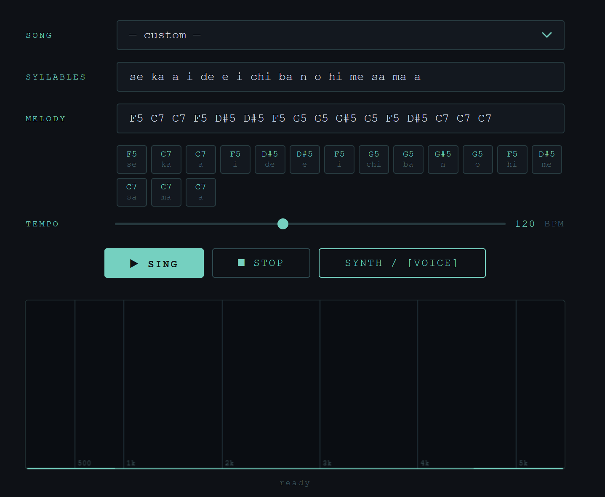

# utagoe | 歌声シンセサイザー 

A Japanese singing voice synthesizer built entirely in WebAudio that takes romaji syllables and note names as input and produces a synthetic voice that sings them.



---

## Demo

<a href="https://youtu.be/GSddzD1q-Cs">
  
</a>

<sub>Watch demo ^^ (right click --> new tab)</sub>

[Try it live](https://kysariin.github.io/utagoe_synthesizer/)

Preloaded songs include World is Mine, Melt, Sakura, Rolling Girl, and Twinkle Twinkle.

---

## How It Works
###### big thanks to Claude for aiding me in even MILDLY understanding how this all works

The synthesizer is based on the **source-filter model of speech**: a custom `PeriodicWave` oscillator approximates vocal cord vibration, and a bank of four parallel `BiquadFilter` nodes tuned to formant frequencies shapes it into vowel sounds. Consonants are modeled by type. Plosives use closure + noise burst + F2 locus transition, fricatives gate the voice and route filtered noise, nasals suppress upper formants and use a bilabial release sweep, taps are brief amplitude dips, glides sweep F1 and F2 from consonant positions into the vowel.

A **voice mode** swaps the synthetic oscillator for a recorded vowel sample pitch-shifted via `playbackRate`, running through the same filter chain.

---

## Running It

[https://kysariin.github.io/utagoe_synthesizer/](https://kysariin.github.io/utagoe_synthesizer/)

---

## Usage

**Syllables** : space-separated romaji, one syllable per token. The standalone nasal mora ん is entered as `n`. Double consonants like っ are entered as the consonant repeated, e.g. `tte`.

```
se ka a i de e i chi ba n o hi me sa ma a
```

**Melody** : space-separated note names in scientific pitch notation, one per syllable. Sharps supported, flats supported (e.g. `D#5`, `Eb5`). Velocity can be added with a colon: `C5:80`.

```
F5 C6 C6 F5 D#5 D#5 F5 G5 G5 G#5 G5 F5 D#5 C6 C6 C6
```

**Tempo** : BPM slider, 60–200.

**Synth / Voice** : toggles between the synthetic glottal oscillator and the recorded voice sample (`ahhh_normalized.wav`). Voice mode requires the wav file to be present in the root directory.

**Preloaded songs** : select from the dropdown to auto-fill syllables, melody, and tempo.

---

## File Structure

```
utagoe_synthesizer/
├── index.html
├── style.css
├── ahhh_normalized.wav     # voice sample for voice mode
└── src/
    ├── audioGraph.js       # AudioContext, filter/source factories
    ├── phonemes.js         # vowel formant targets, consonant data, syllable parser
    ├── sequencer.js        # scheduling engine, signal chain
    ├── noteUtils.js        # note name → Hz conversion
    ├── ui.js               # input handling, note grid, song presets
    └── visualizer.js       # real-time FFT canvas
```

---

## Notes on Reproducibility

- Tested in Chrome.
- Voice mode requires `ahhh_normalized.wav` in the root directory. A replacement sample should be a sustained vowel at a known fundamental (update the `265.7` reference pitch in `sequencer.js` to match).
- Formant synthesis loses definition above C6 — when the fundamental approaches F1, the filters can't independently shape the lower resonances and high notes sound progressively thinner.

---

## Related Work

- [Pink Trombone](https://dood.al/pinktrombone/) — Neil Thapen's real-time articulatory vocal tract synthesizer
- [cwilso Vocoder](https://github.com/cwilso/Vocoder) — WebAudio vocoder used in meSing
- [meSing](https://github.com/usdivad/mesing) — singing synthesizer via TTS + vocoder

---

*Computational Sound | Barnard College / Columbia University | Spring 2026*
